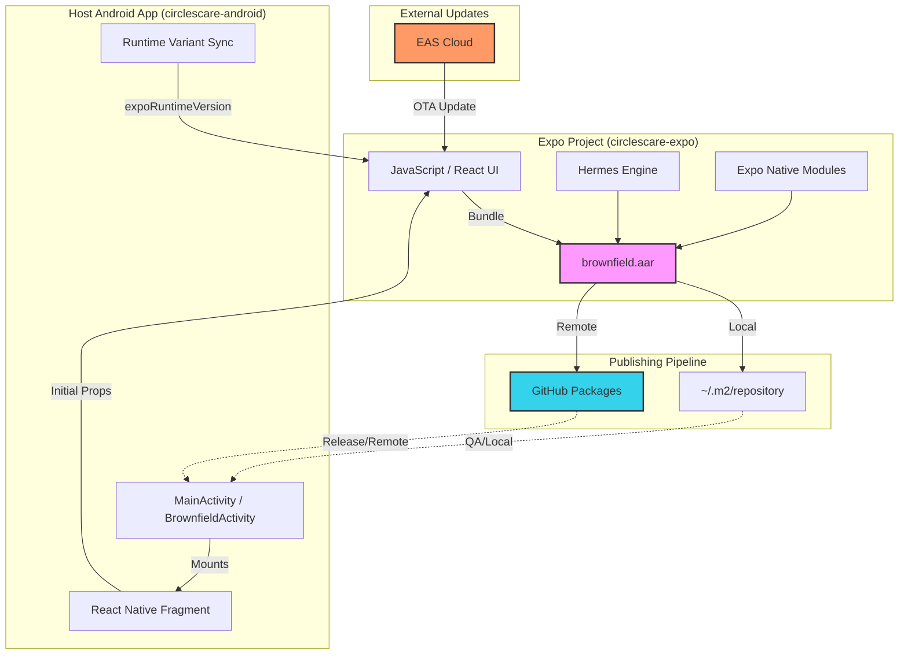
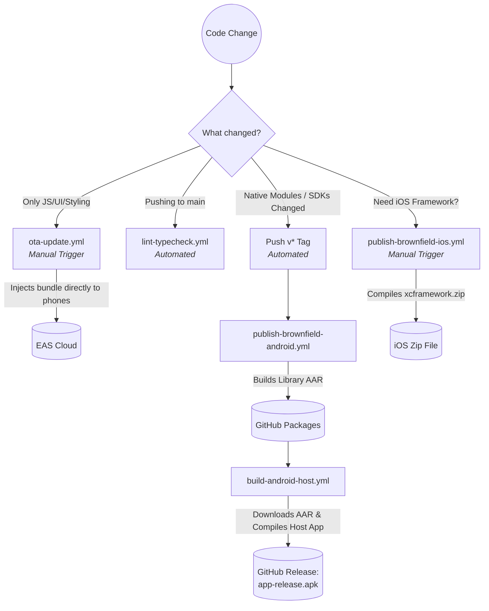

# Circles Hybrid Proof of Concept (cl-poc) — Master Architecture & Release Guide

This document acts as the **Single Source of Truth** for the entire `cl-poc` cross-platform brownfield application.

---

## 1. Project Structure

```text
cl-poc/
├── circlescare-expo/          # Expo / React Native source app
│   ├── app.json               # Native versions, Expo plugins
│   ├── eas.json               # EAS Build & Update profiles
│   └── artifacts/             # iOS XCFramework outputs
├── circlescare-android/       # Native Android host app
│   ├── app/build.gradle.kts   # Environment & variant configuration
│   └── gradle/libs.versions.toml # Brownfield version source
├── circlescare-ios/           # Native iOS host app
│   └── circlescare-ios/       # Linked XCFrameworks & ContentView.swift
└── .github/workflows/         # CI/CD Pipeline automations
```

---

## 2. Android Brownfield Architecture Diagram

This diagram illustrates how the **Expo Feature App** is bundled into a native library and consumed by the **Android Host App**.



---

## 3. Version Compatibility Matrix

Ensure your local machine matches these versions before attempting Native builds.

| Tool | Required Version |
|---|---|
| Android Gradle Plugin | 8.9.1 |
| Gradle | 8.11.1 |
| Kotlin | 2.2.20 |
| NDK | 27.1.12297006 |
| Android compileSdk | 36 (required for AndroidX compatibility) |
| Android targetSdk | 35 (Stable Android 15 runtime) |
| Expo SDK | 55 |
| React Native | 0.83.6 |
| Node | 20+ |
| Xcode | 16+ |
| EAS CLI | 18.7.0+ |

---

## 4. Package & Namespace Reference

| Layer | Type | Package Name / ID |
|---|---|---|
| **Expo Library** | Java Package | `com.circles.circlescare` |
| **Expo Library** | Maven Artifact | `com.circles.circlescare:brownfield` |
| **Android Host** | Application ID | `com.circles.circlescare_android` |
| **Android Host** | Debug ID | `com.circles.circlescare_android.debug` |
| **Android Host** | QA ID | `com.circles.circlescare_android.qa` |

---

## 5. Quick-Start Local Development

Use this day-to-day when writing Javascript/UI code.

### 5a. Start the Metro Bundler
```bash
cd circlescare-expo
npm install
npm start
```
Metro provides local server hosting for the React Native JS on `http://localhost:8081`. 

### 5b. Launch the Custom Android Host App (With Hot Reloading)
In a secondary terminal, install the **Debug APK**:
```bash
cd circlescare-android
./gradlew installDebug
```

### 5c. Launching Standalone React Native App (No Custom Host)
If you want to test purely the UI/JS without compiling the custom `circlescare-android` codebase:
```bash
cd circlescare-expo
npm run android    # Boots standard Expo standalone app
npm run ios        # Boots standard Expo simulator app
```

---

## 6. Android Brownfield Architecture (Debug vs QA vs Release)

The core architecture bridging Native and Javascript relies on separating the **Native Engine** (which compiles slowly) from the **Javascript UI** (which can be streamed instantly). 

It is best visualized as **Two Layers**:
1. **Native Layer**: Android library (AAR) + native dependencies (Expo Modules). This requires a new Native Publish whenever native code/SDKs change.
2. **Update Layer**: JS bundle and assets. This can be delivered instantly via OTA updates if the `runtimeVersion` (set to `appVersion`) matches the native binary.

### The Android Sync Mechanism & Dynamic Environments
- **App Name:** `Circles Debug`
- **Branding:** Ice Blue Background with Dark Blue Logo.
- **How it Works:** 
  1. Checks `USE_METRO=true` injected during the build.
  2. The custom Android host establishes a direct HTTP connection to `localhost:8081` via an ADB reverse proxy.
  3. It streams live Javascript payloads directly from your active Metro Terminal (`npm start`) allowing instant Fast Refresh.
- **Network Constraints (Dev Only):** The debug build requires cleartext HTTP traffic to communicate with Metro. This is handled dynamically via `app/src/debug/AndroidManifest.xml` pulling `<application android:networkSecurityConfig="@xml/network_security_config" />`. Do NOT manually place this inside the `main` App Manifest, as it will break the production build!

### B. QA Build (Static Pre-compiled Bundle)
- **App Name:** `Circles QA`
- **Branding:** Yellow Background with Brown Logo.
- **How it Works:**
  1. Checks `USE_METRO=false`.
  2. Extracts the fully compiled, minified `index.android.bundle` inside the AAR natively generated during publish. 
  3. Metro is skipped entirely to mimic offline production behavior securely.

### C. Release Build (Production Fallback)
Named **"CirclesCare"**. Pulls `brownfield.aar` exclusively from GitHub Packages securely without relying on local builds. Uses a **Clean White** adaptive icon background.

### Native Host Integration Example
In a real-world host application, you mount the Expo screen from a native `Activity` by calling the generated brownfield helpers:

```kotlin
class ExpoFeatureActivity : BrownfieldActivity() {
  override fun onCreate(savedInstanceState: Bundle?) {
    super.onCreate(savedInstanceState)
    // "main" corresponds to the index entry point in app.json
    showReactNativeFragment("main")
  }
}
```
*The generated brownfield module creates a shared `ReactHost`, mounts the view, and handles native back-navigation automatically. We use **`expo-updates` runtimeVersion manifest placeholders** to sync the variant name from Gradle to JS.*

---

## 7. iOS Brownfield Architecture Deep-Dive

Unlike Android which utilizes a remote/local Maven resolving pipeline, iOS operates entirely on a strictly local static XCFramework pipeline. 

The XCFramework is built dynamically from `circlescare-expo` and directly embedded into the native Xcode project.

### How the iOS Host Execution Works
`ContentView.swift` handles the core integration naturally. The host initializes the exact same Javascript bridge natively via Swift UI:

```swift
import circlescareexpobrownfield

struct ContentView: View {
    init() {
        ReactNativeHostManager.shared.initialize()
    }
    var body: some View {
        ReactNativeView(moduleName: "main")
            .ignoresSafeArea()
    }
}
```

### Linking the Framework Properly
If the iOS team runs into the error: `module 'circlescareexpobrownfield' not found`, it is because the XCFramework is missing from the Xcode project workspace.

**Fix:** In Xcode → Project settings → Frameworks, Libraries, and Embedded Content — you must manually drag and add `circlescareexpobrownfield.xcframework` and `hermesvm.xcframework`. 

---

## 8. The 30 Native Packages Explanation

`expo-brownfield` deliberately republishes transitive module dependencies (like `expo-camera`, `expo-router`, etc.) into GitHub Packages via `npm run publish:android:brownfield`. 

Because Expo native modules are built entirely from source against `node_modules`, `circlescare-android` would crash if it couldn't find them on a remote Maven registry.

**Core Packages generated out of the 30:**
- `com.circles.circlescare:brownfield` - The AAR entry point container.
- `host.exp.exponent:expo-modules-core` - The C++ JSI Bridge syncing Native API to JS.
- `expo.modules.router:expo-modules-router` - Powers strict deep linking.
- `com.swmansion.reanimated:react-native-reanimated` & `gesture-handler` - Unlocks native 60fps animations.

You **cannot** remove any of these 30 artifacts manually. To safely drop an artifact (e.g. `expo-haptics`), you must remove it from `circlescare-expo/app.json` dependencies, and re-run the publish script.

### C. Generating Local Android Artifacts (APK / AAB)
To generate shareable files for testing on real devices without using the terminal, run these from `circlescare-android`:

*   **Generate Debug APK**: `./gradlew assembleDebug`
    *   *Path*: `app/build/outputs/apk/debug/app-debug.apk`
*   **Generate QA APK**: `./gradlew assembleQa`
    *   *Path*: `app/build/outputs/apk/qa/app-qa.apk`
*   **Generate Release APK**: `./gradlew assembleRelease`
    *   *Path*: `app/build/outputs/apk/release/app-release.apk`
*   **Generate Production AAB**: `./gradlew bundleRelease`
    *   *Path*: `app/build/outputs/bundle/release/app-release.aab`

---

## 9. The Build & Distribution Matrix

### Android Host Build Matrix

| Command | What it builds | Metro required | Use case |
|---|---|---|---|
| `./gradlew assembleDebug` | Debug APK (`Circles Debug`) | Yes | Dev on local device with Hot Reload |
| `./gradlew assembleQa` | QA APK (`Circles QA`) | No | Internal Testing / Static Bundle |
| `./gradlew assembleRelease` | Release APK (`CirclesCare`) | No | Offline Production APK (Local Test) |
| `./gradlew bundleRelease` | Release AAB | No | Play Store Upload Format |
| `eas build --platform android --profile preview` | Release APK (Cloud) | No | EAS Build QA Link |
| `eas build --platform android --profile production` | Signed AAB (Cloud) | No | EAS Build Play Store Delivery |

### iOS Host Build Matrix

| Method | What it builds | Use case |
|---|---|---|
| Xcode → Run (Cmd+R) | Debug build on simulator/device | Dev iteration |
| Xcode → Archive | Release build | TestFlight / App Store |
| `eas build --platform ios --profile preview` | IPA (cloud) | Internal QA Link |

---

## 10. GitHub Actions CI/CD Map



All workflow automation files live inside `.github/workflows/`. They are designed to automate Testing, Native Publishing, Android Host compiling, and Over-The-Air updates.

### Workflow Directory & Use Cases

1. **`lint-typecheck.yml`**
   - **Trigger**: Automatic on pushing to `main` or opening a PR.
   - **When to rely on it**: Use this workflow purely as an automated quality gate. It runs `tsc --noEmit` and `expo lint`, explicitly blocking any code merges that contain strict TypeScript violations or formatting errors.
2. **`ota-update.yml`**
   - **Trigger**: Manual (`workflow_dispatch`).
   - **When to rely on it**: Use this when you patch a UI bug or pure Javascript logic and want the fix live globally without waiting on the Google Play store. It exclusively uses Expo EAS to securely bypass native stores and inject Javascript live.
3. **`publish-brownfield-ios.yml`**
   - **Trigger**: Manual (`workflow_dispatch`).
   - **When to rely on it**: Use this strictly when you update native SDKs or Expo native modules and need to generate a fresh `xcframework.zip` for importing physically into Xcode.

### 🏷️ The Automated Git Tagging Strategy
The two most critical workflows in the project explicitly listen for **Git Tags** (`v*`) to completely automate your deployment to production.

When you are ready to formally freeze a version, **always cut a Git Tag**.

#### 1. `publish-brownfield-android.yml` (Native Library Automation)
   - **Trigger**: Automatically runs when you push a tag like `v1.0.0` (also supports manual trigger).
   - **When to use**: When your React Native/Expo code is complete and stable, pushing a tag triggers this file to automatically parse the code, strip the native C++ Hermes engine via the NDK, and securely upload the resulting `1.0.0.aar` directly to **GitHub Packages**. 

#### 2. `build-android-host.yml` (Host App Release Automation)
   - **Trigger**: Automatically runs when you push a tag (and on `main` branch merges without the tag).
   - **When to use**: Once the AAR is published via the library workflow above, this workflow dynamically downloads that AAR, compiles it natively using the `.jks` base64 secret, and securely generates a production physical `app-release.apk`.
   - **The Tag Bonus**: If triggered by a `v*` tag, this workflow actively utilizes the `softprops/action-gh-release` pipeline to formally create a "GitHub Release" web page on your repository and attach the actual `.apk` so non-developers can download it!

### 📝 Example: How to generate a Tag & Run the Pipeline
Once you bump versions in `app.json`, `package.json`, and `libs.versions.toml`:

```bash
# 1. Commit your version bumps
git commit -m "chore: release version 1.0.5"
git push origin main

# 2. Tag the commit locally and push the tag
git tag v1.0.5
git push origin v1.0.5
```
**How to Verify Everything Succeeded:**
1. Check the GitHub **Actions** tab — both `Publish Brownfield Android` and `Build Android Host` will be spinning concurrently automatically.
2. In your repo sidebar, click **Packages** to verify `v1.0.5` AAR deployed properly.
3. In your repo sidebar, click **Releases** to physically download and test your `app-release.apk`.

### Cloud Keys & CI Secrets Required
If you intend to run full `.apk` / `.aab` production assemblies from GitHub Actions natively or trigger OTA updates, you must provide the following:

1. **`GITHUB_TOKEN`**: Read/Write access naturally built-in by GitHub Actions. (No manual setup needed).
2. **`EXPO_TOKEN`**: This is your Expo access key. Generate it at [expo.dev > Settings > Access Tokens](https://expo.dev/settings/access-tokens).
   - **Required Repository Secret**: `EXPO_TOKEN`
   - **Used By**: `.github/workflows/ota-update.yml` and `eas build`.
   - **How it works under the hood**: The OTA workflow uses this token to authenticate the `eas-cli` on the CI server. This allows GitHub Actions to securely compile and digitally sign your JavaScript bundle, then push the Over-The-Air update directly to Expo's cloud so users' phones receive the patch instantly (without requiring a Native AAR or APK rebuild).
3. **Android Keystore Secrets (For Native Host Actions):** If you run `build-android-host.yml` to produce a production build, your action environment expects four secrets. Because `.jks` files are ignored by git, you must upload the file as a Base64 string.
   
   **How to copy your keystore to Base64 (Run in terminal):**
   ```bash
   base64 -i circlescare-android/circlescare-release.jks | pbcopy
   ```
   *(This copies a giant string to your clipboard. Paste it into the `SIGNING_KEYSTORE_BASE64` secret).*

   **Required Repository Secrets:**
   - `SIGNING_KEYSTORE_BASE64`: The Base64 string copied from the command above.
   - `SIGNING_STORE_PASSWORD`: Keystore password.
   - `SIGNING_KEY_ALIAS`: Keystore alias name.
   - `SIGNING_KEY_PASSWORD`: Keystore key password.
   
   *(Gradle uses these to seamlessly sign the native application without storing passwords or raw `.jks` files loosely in the repo).*
4. **Apple Credentials / Standalone Keystores:** All other iOS Apple Developer configurations and Expo Standalone keystores are **automatically managed by EAS** during an `eas build` trigger and do not require manual GitHub Repository setups.

## 11. Native Publishing (AAR Deployment)

Whenever you add a native module, change an Expo plugin, or upgrade the native SDK version, you must publish a new version of the Native AAR. 
*Note: Which publish script you run depends entirely on which build variant you plan to test.*

### A. Local Publish (Mandatory for `QA` build)
**How it works:** This command bypasses the cloud entirely. It runs a local Gradle task that compiles the React Native bundle and Native code into a raw AAR package, then explicitly dumps it into your Mac's cached `~/.m2/repository` folder. This ensures your local Android Studio QA builds can consume the fresh AAR instantly while heavily isolated from network dependencies.

- **Debug Build (`assembleDebug`)**: Does *not* require an AAR publish if using live Metro (`npm start`).
- **QA Build (`assembleQa`)**: **Requires this**. The QA variant resolves the AAR purely from your local maven cache.

1. `cd circlescare-expo`
2. `npx expo prebuild -p android --clean`
3. `cd android`
4. `./gradlew publishToMavenLocal`

### B. Remote Publish (Mandatory for `Release` build)
**How it works:** This runs the `publishBrownfieldReleasePublicationToGithubPackagesRepository` script. Using your GitHub API token (`gpr.user`/`gpr.key` in `local.properties`), it natively authenticates and uploads the final release AAR securely to the GitHub Packages cloud registry. This guarantees CI servers and developers download the identical binary release everywhere.

- **Release Build (`assembleRelease` / `bundleRelease`)**: **Requires this**. The Release variant resolves the AAR exclusively from the remote GitHub registry.

```bash
cd circlescare-expo
npm run publish:android:brownfield
```
#### 🛡️ Version Sync & NDK Safety Guards
The `publish:android:brownfield` script includes several critical safety layers:
1. **Sync Check**: It reads `circlescare-expo/app.jsonThe Host Application` and `circlescare-android/gradle/libs.versions.toml`. If the versions don't match exactly, the publish **fails**.
2. **Immutability**: GitHub Packages is **immutable**. You cannot overwrite version `1.0.2` once it’s live. You must bump both files and re-publish.
3. **NDK Reset (`--clean`)**: It forces `npx expo prebuild --clean`. This deletes the `android` folder entirely before regenerating it, ensuring no stale C++ artifacts or old NDK states survive the build.
4. **`expo-updates` NDK Patch**: The project utilizes `scripts/fix-expo-updates-ndk.js` (hooked into `postinstall`). This forces the `expo-updates` module to respect the project's locked NDK version (`27.1.12297006`), preventing native initialization crashes.

---

## 12. Full Release & Update Checklists

### When to use OTA vs Native Publish?

| Changed Element | Action Required |
|---|---|
| JS code, screens, UI Styles, Images | **OTA update only** |
| Navigation structure (JS router) | **OTA update only** |
| New JS-only NPM Package | **OTA update only** |
| New NPM package with Native Native code | Native publish → Host Rebuild |
| Expo SDK version bump | Native publish → Host Rebuild |
| Android permissions / iOS Info.plist | Native publish → Host Rebuild |

### 🛠 Scaffold Release (A Native Change occurred)
*Trigger when updating SDKs, adding Native Modules (Camera/Sensors), Updating core manifests.*

> [!IMPORTANT]
> **Version Bump Checklist — All 3 files MUST be updated together:**
>
> | # | File | Field | Example |
> |---|---|---|---|
> | 1 | `circlescare-expo/app.json` | `expo.version` | `"1.0.3"` |
> | 2 | `circlescare-expo/package.json` | `version` | `"1.0.3"` |
> | 3 | `circlescare-android/gradle/libs.versions.toml` | `brownfield` | `"1.0.3"` |
>
> The publish script **will fail** if `app.json` and `libs.versions.toml` don't match. `package.json` is not checked automatically but must stay in sync for consistency.

1. Bump version in all 3 files listed above.
2. CI Server: **GitHub Actions → `Publish Brownfield Android` → Run Workflow**.
4. Verify deployment at `https://github.com/iniyan-circles/Expo/packages`.
5. CI Server: **Run `eas build --platform android --profile production`** to produce the resulting Android Host AAB for Google Play.
6. **For iOS:** Run `eas build --platform ios --profile production`. Alternatively, locally extract XCFrameworks from CI and link them via Xcode:
```bash
cp -R "circlescare-expo/artifacts/circlescareexpobrownfield.xcframework" "circlescare-ios/"
```

### 🚀 Over-The-Air (OTA) Release (JS/UI/Asset Change occurred)
*Trigger when patching Javascript bugs or refining UI elements exclusively. Store submissions are skipped entirely.*

1. Merge Javascript Changes to `main`.
2. **Cloud Method:** GitHub Actions -> `OTA Update (EAS)` -> Select `production` branch -> Run Workflow.
3. **Local Developer Method:** 
```bash
cd circlescare-expo
eas update --branch production --message "feat: updated onboarding visuals"
```
4. Done. Any user running the app automatically pulls the JS patch on next launch.

---

## 13. Setup & Credentials Troubleshooting

### Local Development Keys (`local.properties`)
To pull or publish Android dependencies locally from GitHub Packages, your machine must authenticate. **If you don't have these credentials, contact Iniyan Murugavel.**

Define these inside `circlescare-android/local.properties`:
```properties
gpr.user=YOUR_GITHUB_USERNAME
gpr.key=ghp_YOUR_CLASSIC_GITHUB_TOKEN
```

**When is this required?**
-   **Mandatory** for publishing to GitHub Packages.
-   **Mandatory** for fresh builds if the `brownfield.aar` is not already in your `mavenLocal()`.
-   **Optional for Debug (Emulator)**: If you only test on an emulator and the brownfield AAR is already cached locally, you can skip this.
-   **metro.host**: If testing on a physical device, use `local.properties` to set `metro.host=YOUR_MAC_IP`.

> **Warning**: Never commit `local.properties`!

#### How to create a GitHub Classic PAT
If you are hit with a `401 Unauthorized` or `403 Forbidden`, ensure you are using a **Classic** token with the following settings:
1. Go to [github.com/settings/tokens](https://github.com/settings/tokens).
2. Click **Generate new token → Generate new token (classic)**.
3. Select scopes: **`read:packages`** and **`write:packages`**.
4. Generate and immediately copy the token into `circlescare-android/local.properties` as `gpr.key`.
*Note: Fine-grained tokens are NOT supported for GitHub Packages Maven registries.*

### Force Remote Dependency Sync (Cleanup)
If you want to ensure that your host app pulls the latest AAR from **GitHub Packages** instead of your local cache (mavenLocal), run:
```bash
rm -rf ~/.m2/repository/com/circles/
```
Once deleted, Gradle will be forced to fetch the library remotely on the next build.

### Error: EADDRINUSE Port 8081
```bash
lsof -i :8081 
kill -9 <PID>
npm start -- --clear      # Hard flush metro bundle
```

### Error: NDK Mismatch (CXX1101 / CXX1104)
1. Open Android Studio -> SDK Manager -> SDK Tools -> NDK (Side By Side).
3. **Enable 16 KB Page Support**: This project uses `useLegacyPackaging = false` and NDK r27 to support modern Android 15 performance standards.

### Error: 401 Unauthorized during Publish or Sync
Ensure your `local.properties` PAT is not expired.
Test via terminal natively:

| Command | Action |
|---|---|
| **Hard Clear Metro Cache** | `npm start -- --clear` |
| **Inspect Dependency Tree** | `./gradlew :app:dependencies` |
| **Force Refresh Dependencies** | `./gradlew build --refresh-dependencies` |
| **Uninstall All Variants** | `./gradlew uninstallAll` |
| **Verify GitHub Token** | `curl -H "Authorization: token $TOKEN" https://api.github.com/user` |

If it doesn't return `200`, generate a new classic Token.

### Error: 409 Conflict during Github Release Publish
You attempted to overwrite an existing AAR version. GitHub Packages is immutable! You must bump BOTH `app.json` and `libs.versions.toml` synchronously and re-run.

---

## 14. Developer Testing Etiquette (Do's & Don'ts)

To maintain a clean brownfield architecture, follow these testing standards.

### ✅ DO (Best Practices)
*   **Test UI purely in JS**: Use `npm start` and `USE_METRO=true` (Debug variant) for 99% of your UI/JS changes. It’s faster and maintains the bridge.
*   **Verify on Physical Devices**: Always run `adb reverse tcp:8081 tcp:8081` when using a physical Android device to ensure it can see your local Metro server.
*   **Test "Offline" in QA Variant**: Before submitting a PR that includes native changes, build the **QA variant** (`./gradlew assembleQa`). This ensures your pre-compiled bundle is correctly packed inside the AAR and works without Metro.
*   **Use `logcat` for Native Crashes**: If the app crashes on launch, it's likely a Native JSI bridge error. Use the logs: `adb logcat *:S ReactNative:V ReactNativeJS:V`.
*   **Keep Versioning in Sync**: If you bump the version in `app.json`, immediately update `libs.versions.toml` to match. 

### ❌ DON'T (Common Pitfalls)
*   **Don't Modify `circlescare-android` for UI**: Never try to fix a spacing or color issue by modifying the native Android XML files. Always fix it in `circlescare-expo`.
*   **Don't ignore the Metro Console**: If the screen is white, the error is almost always in the Metro terminal. Check there before deep-diving into Android Studio.
*   **Don't commit `local.properties`**: This file contains your personal GitHub Token. It must stay local.
*   **Don't forget to push OTA**: If your change is JS-only, don't force a Native AAR publish on the whole team. Use the **OTA Update** pipeline instead.
*   **Don't mix Manifests**: Never put debug-only permissions (like `networkSecurityConfig`) into the `main` AndroidManifest. Keep them in `src/debug/`.

---

## 15. Useful References

- **Expo Brownfield SDK**: [docs.expo.dev/sdk/brownfield](https://docs.expo.dev/versions/latest/sdk/brownfield/)
- **Expo Updates (OTA)**: [docs.expo.dev/sdk/updates](https://docs.expo.dev/versions/latest/sdk/updates/)
- **Runtime Versions Guide**: [docs.expo.dev/eas-update/runtime-versions](https://docs.expo.dev/eas-update/runtime-versions/)
- **GitHub Packages Maven Registry**: [maven.pkg.github.com/iniyan-circles/Expo](https://maven.pkg.github.com/iniyan-circles/Expo)

---

## 16. Project Economics & Licensing

### 🕊️ Is Expo Open Source?
Yes. The **Expo SDK**, **Expo CLI**, and the underlying **React Native** framework are all open-source (MIT License). You can use them for free in perpetuity without paying for any cloud services.

### 💰 EAS Cost & Usage Limits (Cloud Services)
While the core tools are free, **Expo Application Services (EAS)** provides cloud-based convenience. As of 2026:

| Service | Free Tier | Use Case |
|---|---|---|
| **EAS Build** | 15 Android + 15 iOS builds / month | Generating APKs/AABs in the cloud. |
| **Local Build** | **Unlimited & Free** | Running `./gradlew` locally on your hardware. |
| **EAS Update** | First 1,000 MAU free | Sending OTA JS patches to users. |
| **EAS Submit** | Included in Free Tier | Automating App Store / Play Store uploads. |

- **MAU (Monthly Active User)**: Defined as a unique app installation that downloads at least one update during the month. If you have 5,000 users but only send an update to 500 of them, your MAU count for that month is 500.
- **Reference**: [Expo Pricing Page](https://expo.dev/pricing)

### ⏱️ ETA & Update Delivery
Updates sent via EAS Update are typically delivered to clients within **1–5 seconds** of the app being launched (over a standard 4G/5G connection).
- **Reference**: [EAS Update Concepts](https://docs.expo.dev/eas-update/how-it-works/)

